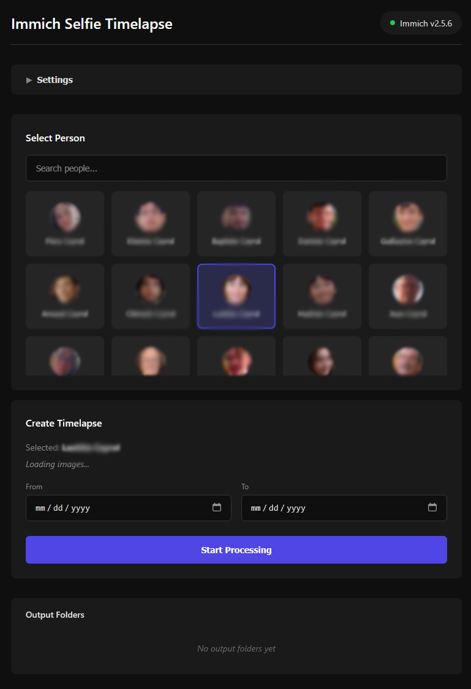
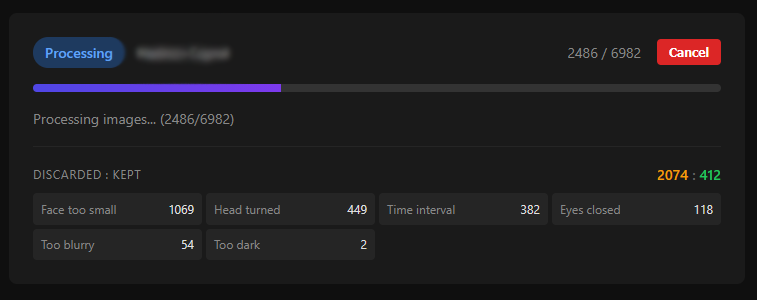
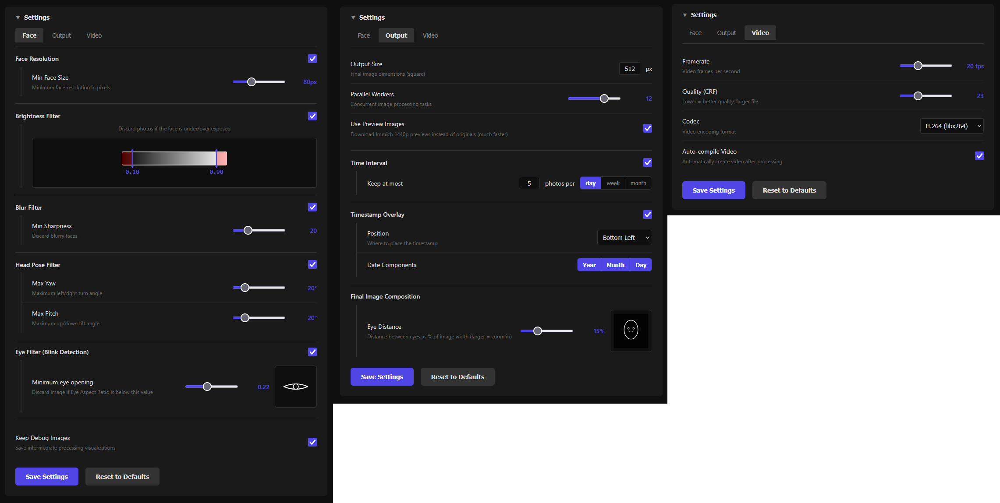

# Immich Selfie Timelapse

***Generate timelapse videos of your loved ones' portraits from your [Immich](https://immich.app/) photo library.***

Use Immich's built-in face recognition to find all photos of a person, then runs them through a configurable processing pipeline that crops, aligns, filters, and compiles the results into a smooth timelapse video.

<p align="center">
  
</p>

<p align="center">
  
</p>

## Features

- **Face detection & cropping** - Uses Immich's face recognition metadata to locate and crop faces automatically
- **Face alignment** - Aligns all photos based on eye positions for a stable, smooth timelapse
- **Head pose filtering** - Skips non-front-facing photos using an ONNX deep learning model (DMHead)
- **Blink detection** - Filters out photos where eyes are closed using Eye Aspect Ratio analysis
- **Blur detection** - Discards blurry photos using gradient magnitude analysis (Sobel operator)
- **Brightness filtering** - Removes photos that are too dark or overexposed
- **Face resolution filtering** - Skips photos where the face is too small
- **Photo limiting** - Caps photos per day/week/month to avoid over-representing busy periods
- **Timestamp overlay** - Optionally overlays the date on each frame
- **Video compilation** - Automatically compiles processed photos into an MP4 timelapse using FFmpeg
- **Web UI** - Configure all settings and monitor progress through a built-in web interface

<p align="center">
  
</p>

## Quick Start

### Immich API key

To access your immich library, this project requires an Immich API key.  
Follow this guide to create one: https://immich.app/docs/features/command-line-interface#obtain-the-api-key

Here are the features that need to be enabled:
- server.about
- asset.download
- asset.read
- person.read

*Note: It is advised to store this API key in a `.env` file adjacent to your `docker-compose.yml` rather than in plain text.*

### Docker Compose (recommended)

```yaml
services:
  immich-selfie-timelapse:
    image: arnaudcayrol/immich-selfie-timelapse
    container_name: immich-selfie-timelapse
    ports:
      - "5000:5000"
    environment:
      - IMMICH_API_KEY=abcdefghijklmnopqrstuvwxyz
      - IMMICH_BASE_URL=http://your-immich-host:2283
    volumes:
      - ./config:/app/config
      - ./output:/app/output
    restart: unless-stopped
```

### Docker Run

```bash
docker run -d \
  --name immich-selfie-timelapse \
  -p 5000:5000 \
  -e IMMICH_API_KEY=your-api-key-here \
  -e IMMICH_BASE_URL=http://your_server:2283 \
  -v ./config:/app/config \
  -v ./output:/app/output \
  arnaudcayrol/immich-selfie-timelapse
```

Then open **http://your_server:5000** to access the web interface.

### Volumes

| Path | Description |
|---|---|
| `/app/config` | Persisted configuration file (`config.toml`) |
| `/app/output` | Processed images and compiled timelapse video |

### Settings

The default settings are quite permissive because every human being is unique.  
Please adjust image brightness filtering, eye aspect ratio etc. for the person you are processing.

<p align="center">
  
</p>

## Additional info

- Heartfelt thanks to the Immich team and contributors for making this project possible.
- About contribution : When I first created this project, I marked it as open to contributions. I now realize that I don't have as much time as I thought to dedicate to this project. I feel comfortable with issues being opened as it allows me to go through them at my own pace. For pull requests, I cannot guarantee a reasonable time frame for review. 
- Thank you thomaslrg for the discussions around the project.
- Thank you for the 200 GitHub stars !


## License

This project is open source and available under the [MIT License](LICENSE).
